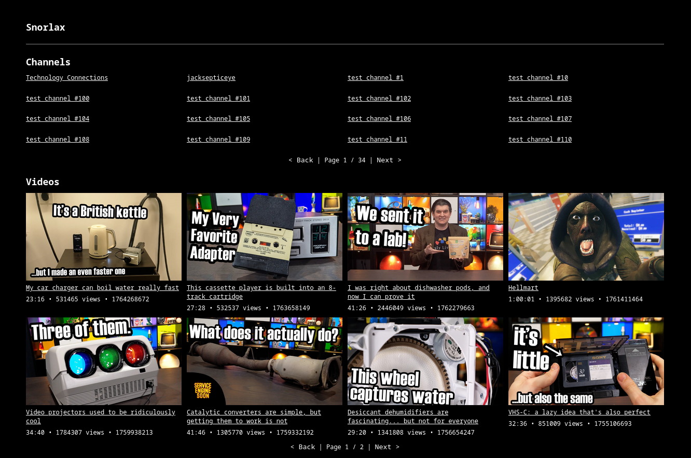

# Snorlax

### Running

```sh
uv pip install .
uv run uvicorn snorlax:app
```

### Configuration

All configuration data for Snorlax is stored in `snorlax.toml`.  

Right now, you can edit:
- `snorlax.database_path`
- `snorlax.video_path`
- `videos.subtitle_languages`
    - List of [yt-dlp](https://github.com/yt-dlp/yt-dlp) compatible subtitle formats, regex supported.
    - See [this issue](https://github.com/yt-dlp/yt-dlp/issues/9371#issuecomment-1978969330) for more information.

### Management

Head to `/manage` and you can add a import job, which currently supports both videos and channels.

### API

```
/v1/videos
/v1/channels
/v1/video/VIDEO_ID
/v1/channel/CHANNEL_ID
/v1/jobs
```

### Screenshot



### Roadmap

- [x] Migrate /watch to an API endpoint, with JS-based humanize
- [x] Migrate the ingest methods to custom API endpoints
- [ ] Ability to set video expiration time, turning Snorlax into something like [cobalt](https://cobalt.tools/)
